## 0. Overview
gsheets is a library for interfacing with Google Sheets, including reading from, writing to, and modifying the formatting of Google Sheets. It is built on top of Google's [google-api-python-client](https://github.com/google/google-api-python-client) and [oauth2client](https://github.com/google/oauth2client) libraries using the [Google Drive v3](https://developers.google.com/drive/v3/reference/) and [Google Sheets v4](https://developers.google.com/sheets/reference/rest/) REST APIs.
<br>
<br>

## 1. Advantages Over gspread

- The uploading of pandas DataFrames is supported.
- Data pulled from Google Sheets will keep the data type they had there, e.g. datetimes will come in as datetimes, numbers as numbers, etc. Within gspread, non-numbers are generally all converted to strings.
- Users can authenticate with their own Google account, meaning there is no need to create a service account and share all your files with it (though you can still do both of those things).
- A number of additional tools are provided for interacting with Google Sheets: format them, add/remove rows and columns, create or delete tabs and workbooks, add or remove permissions, etc. See below for more details.
- The library is built using modern, Google-maintained tools (e.g. Google's google-api-python-client library and oauth2client) as opposed to parsing XML feeds.
<br>

## 2. How To Use
### 2.1 Accessing Workbooks and Tabs
At gsheets' core are three classes -- Client, Workbook, and Tab -- which work together to give the user access to increasingly specific objects. An example using all three classes is the process of getting a tab:
```python
client = gsheets.Client()
wkb = client.get_workbook('my_workbook')
tab = wkb.get_tab('my_tab')
```
<br>

Convenience functions also exist to simplify things. The above can be condensed into one line:
```python
tab = gsheets.open_tab('my_workbook', 'my_tab')
```
<br>

These convenience functions are more useful when creating a workbook and/or tab and accessing it immediately afterward. For example, to create a new tab in a new workbook and immediately return it:
```python
tab = gsheets.create_tab_in_new_workbook(filename='my_new_workbook', tabname='my_new_tab')
```
<br>

The `gsheets.create_tab_in_existing_workbook` convenience function behaves similarly.
<br>
<br>

### 2.2 Getting Data
Getting data is as easy as running `tab.get_data()`. By default this returns the tab's data as a pd.DataFrame, but we could instead return it as a list of lists or list of dictionaries using the `fmt` parameter (i.e. `fmt='list'` or `fmt='dict'`).
<br>
<br>

### 2.3 Uploading Data
Once we have a tab, uploading a pd.DataFrame to it is also a one-liner: `tab.upload_data(df)`

Uploading DataFrames with row and/or column multi-indexes is supported, though you can also choose not to upload the row index if you prefer. Moreover, two kinds of upload are supported:

1. Inserts, which will wipe the contents of the tab before inserting the DataFrame.
2. Appends, which  will add the DataFrame below the current data in the tab.

In addition, by setting `autoformat=True` within the `upload_data` method we can easily format the data set rendered within the tab when we upload it:

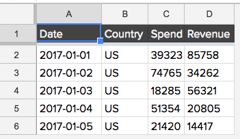

The dimensions of the tab match the data set, the headers are formatted nicely, all cells are left-aligned, and column widths are auto-scaled to fit their contents.
<br>
<br>

### 2.4 Modifying Workbooks, Tabs, and Permissions
A variety of methods are provided to modify workbooks, tabs, and permissions. Supported operations include:
<br>
<br>

#### 2.4.1 Create, Delete, and Show Tabs and Workbooks
A workbook can be created with:
```python
client = gsheets.Client()
wkb = client.create_workbook('my_new_workbook')
```
<br>

Similarly, we can delete a workbook with:
```python
client = gsheets.Client()
client.delete_workbook('my_new_workbook')
```
<br>

Creating and deleting tabs is just as simple:
```python
client = gsheets.Client()
wkb = client.get_workbook('my_new_workbook')
tab = wkb.create_tab('my_new_tab')
wkb.delete_tab('my_new_tab')
```
<br>

In order to find the right workbook or tab it may be helpful to see all items that exist. This is easy to do: we just run `Client.show_all_workbook()` or `Workbook.show_all_tabs()`:

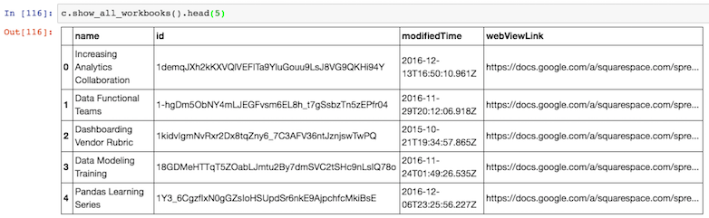
<br>

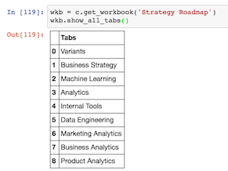
<br>
<br>


#### 2.4.2 Add, Remove, or Show Permissions
Permissions can easily be added to a workbook with `Workbook.add_permission`, including specifying the type of permission (reader, writer, or owner), whether to have Google email the person to notify them of the new permission, and if so what the email message should be:
```python
wkb.add_permission(email='foo@squarespace.com', role='writer',
                   notify=True, message="Here's the 2016 Q1 subscriber projections you'd asked for")
```
<br>

Permissions can be removed just as easily:
```python
wkb.remove_permission('foo@squarespace.com')
```
<br>

And lastly, you can show all permissions on a workbook with `Workbook.show_permissions`:

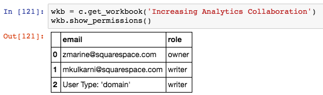
<br>
<br>

### 2.5 Formatting Tabs
A variety of formatting operations are supported, all of which reside on the Tab object. These methods include:
  - tab.format_headers - Format the first n rows in a tab (make their background a dark gray, freeze-frame them, and left align them)
  - tab.format_font - Alter the font and size of the text for all cells in the tab
  - tab.align_cells - Set the horizontal and vertical alignment for all cells in the tab
  - tab.autosize_columns - Auto-adjust the width of all columns in the tab
  - tab.add_columns - Add n columns to the end of the tab
  - tab.add_rows - Add n rows to the end of the tab
  - tab.alter_dimensions - Resize the number of rows and/or columns in the tab, which could include truncating the data if either dimension is smaller than the current values

More details on the above can be found within the method documentation. In addition, anything not explicitly supported by the gsheets library as a stand-alone method can be accomplished using the Workbook.batch_update method and referencing Google Sheets' [spreadsheets.batchUpdate method](https://developers.google.com/sheets/api/reference/rest/v4/spreadsheets/batchUpdate). More details and an example exist within the docstring for `Workbook.batch_update`.
<br>
<br>
<br>

## 3. Initial Setup
To utilize gsheets, you'll need to get it connected to your Google Sheets workbooks. There are two possible ways to do this: user-granted authorization ('OAuth Client ID') or the use of a service account ('OAuth Service Account'), both of which are implemented through the underlying Google [oauth2client](https://github.com/google/oauth2client) library. A description of both authentication mechanisms follows below, but before we can use either mechanism we need to create a project.
<br>
<br>

### 3.1 Set Up A Project
1. Head to https://console.developers.google.com and sign in (or sign up if you haven't yet).
2. Create a new project. You can title this whatever you want; it won't be shown to you or any other end user by gsheets.

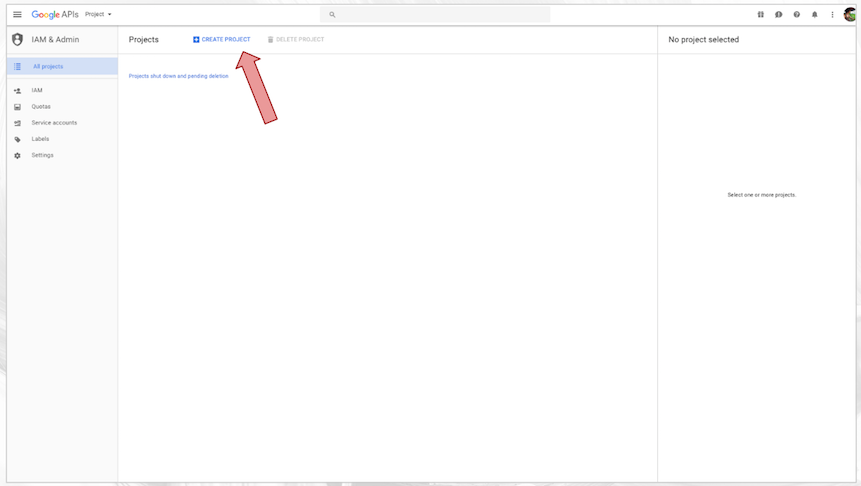
3. Use the search bar at the top to search for Google Drive API, then click 'Enable'. Do the same for the Google Sheets API.

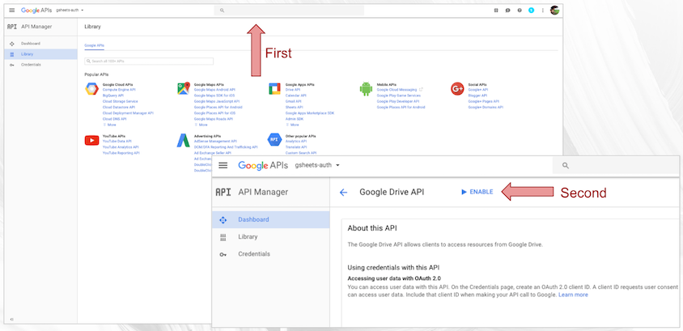
4. Click on ‘Credentials’, go to ‘OAuth consent screen’, add ‘gsheets Python library’ to the Product name shown to users, then click ‘Save’

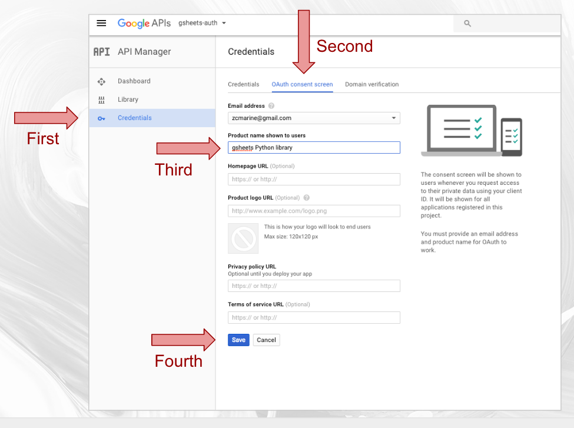
<br>

### 3.2 OAuth Client ID Access
OAuth Client ID access is the kind of auth that shows up when you click ‘Sign in with Google’ on a page: you authorize the application to access the information attached to a Google account. For non-ETL-based use, this is the auth you want. The list of possible accounts to use is based on the gmail accounts tied to that particular browser. The end-user flow, which is entered on instantiation of a `gsheets.core.Client` object, would be as follows:

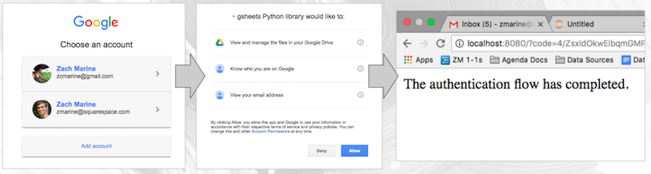

To set this up:
1. Click on 'Create Credentials'.

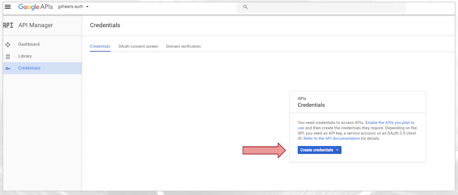
2. Choose 'OAuth client ID'.

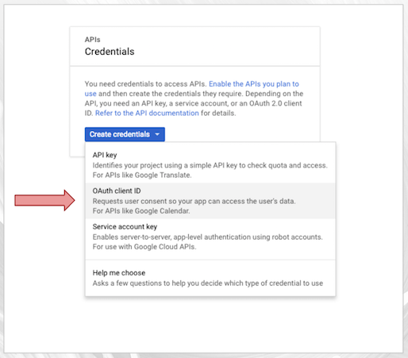
3. Select ‘Web application’. Input a name, Authorized JavaScript origins, and Authorized redirect URIs. These authorized URIs will be the following, with the redirect URIs having a forward slash appended:
- http://localhost:8888
- http://localhost:8080

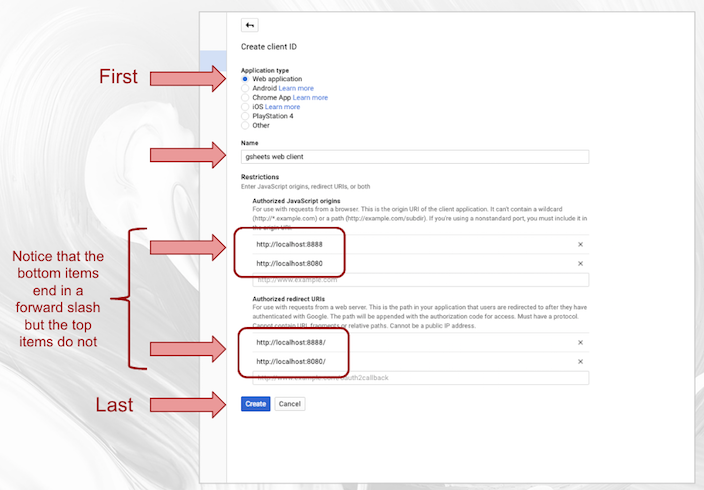
4. Click 'Ok' and then click the download button.

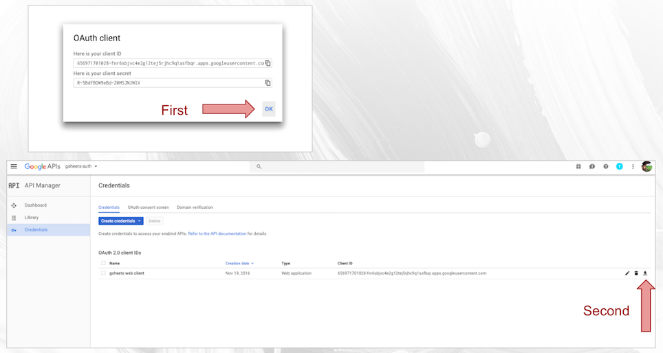
5. Create a folder in your home directory called ‘.gsheets’, rename the file you downloaded to ‘client_secrets.json’, and place it in that new folder. You can do this in Finder, but if you’d prefer terminal follow the commands below, using your client_secrets file’s original name:
<br>

```bash
mkdir ~/.gsheets
mv ~/Downloads/client_secret_<really_long>.apps.googleusercontent.com.json ~/.gsheets/client_secrets.json
```
<br>

Congratulations! You're now set up with client auth and can start using the library!
<br>
<br>

### 3.3 OAuth Service Account Access
OAuth Service Account creates a pseudo-user with an email address. Documents shared with this account will be accessible by the service (this is how gspread works). This approach is ideal for ETL as a user doesn't have to manually authorize access each time. However, a major weakness to this method is that anyone who gets hold of the credentials we are about to generate will be able to access all documents shared with this account, which is a weakness that the OAuth Client ID access does not share. With that in mind, the credentials we are about to generate should be kept secure (i.e. for example, using Ansible Vault in an ETL environment).

To set up service account access:
<br>

1. Click on 'Create Credentials' again, this time choosing 'Service account key'.

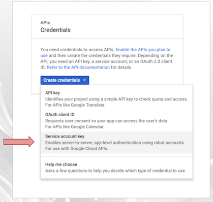
2. Select ‘App Engine default service account’, key type ‘JSON’, and click ‘Create’. The file will automatically be downloaded

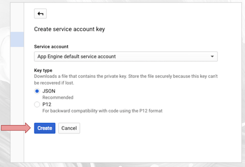
3. As before, save the file to ~/.gsheets, this time called ‘service_key.json’. You can do this in Finder, but if you’d prefer terminal follow the commands below, using your client_secrets file’s original name:
<br>

```bash
mv ~/Downloads/gsheets-auth-1e8be8d27209.json ~/.gsheets/service_key.json
```
<br>

Congratulations! You're all set up! Now just `pip install gsheets` and away you go!

## 4. Copyright and License
Copyright 2017 Squarespace, INC.

Licensed under the Apache License, Version 2.0 (the "License"); you may not use this file except in compliance with the License. You may obtain a copy of the License at:

http://www.apache.org/licenses/LICENSE-2.0

Unless required by applicable law or agreed to in writing, software distributed under the License is distributed on an "AS IS" BASIS, WITHOUT WARRANTIES OR CONDITIONS OF ANY KIND, either express or implied. See the License for the specific language governing permissions and limitations under the License.

